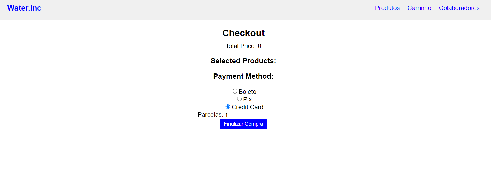

# lojinha de agua - Water.Inc

## resumo
(Site em desenvolvimento)
esse site feito em react tem como objetivo criar um ecommerce de venda de agua, onde o cliente pode ter varias opções de produtos como 500ml, litros e galões.

## Produtos
Menu prototipo de produtos do E-commerce Water.Inc

## Colaboradores
Page prototipo de cadastro de Clientes

## new feature(Details & discription)
adicionei detalhes e descrição de produtos

## Carrinho(Feature)
adicionando pagina carrinho prototipo

## checkout de Produtos(Array setSelectedProducts)
### cartPage:
prdoutos selecionando no carrinho irá para pagina de checkout

### checkoutPage: 
prodouto aparecerá com os iD pela requisição do Json Server

## Pagamentos (paymentMethod)
adicionando sistema de pagamento prototipo

### método Boleto (paymentMethod && paymentData) 
método prototipo de recebimento de boleto

### método Pix (paymentMethod && paymentData)
método prototipo de recebimento de PixKey(ChavePix)

### método Cartão de Crédito (paymentMethod && paymentData)
método prototipo de recebimento de cartão de crédito

### Requisição Get JSON Products:

